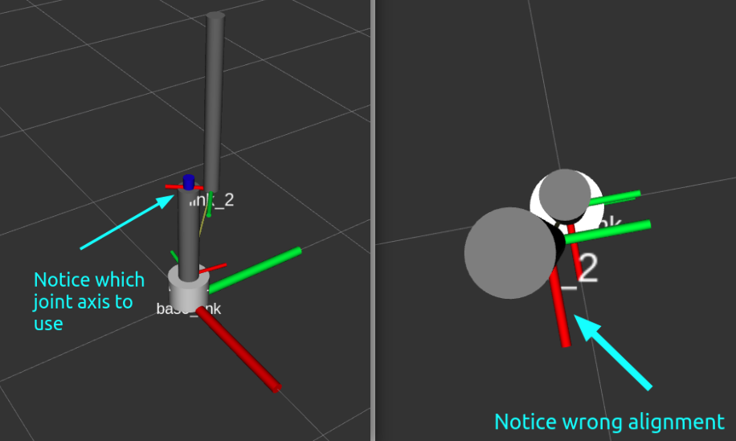
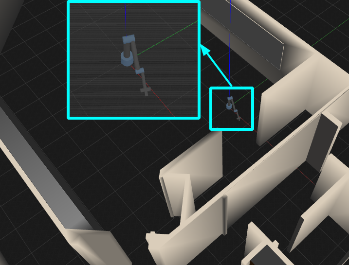

# RRR-robot-arm_ROS
ROS package for 3 DOF Revolute-Revolute-Revolute robot arm built from scratch. The aim of the package is to explain to fellow roboticists about the flow from the arms modeling to using MoveIt for motion planning.

In this package the arm and its gripper are build from scratch using URDF/xacro model. After building the model, the launch files required to visualize it in Rviz, and Gazebo are made. In the next step, MoveIt configuration package for the arm is created. The interface of the MoveIt package with Gazebo for motion planning is also done. 


To use this package, clone it to your ROS `workspace/src` directory as follows:
```
git clone https://github.com/Robotawi/rrr-arm.git
```
Then, build the workspace and the package is ready.

I will explain how to make each step as well as how to use the package at every point.

## 1. Robot visualization in Rviz
This is a must have skill to be able to make the model in the first place.  

To start the arm in Rviz, use the following command
```
roslaunch rrr_arm view_arm.launch 
```

**What does the above roslaunch command launch/start?**
It starts three components:
1. Loading the robot_description from the xacro model to ROS param server.
2. Start joint_state_publisher node.
3. Start robot_start_publisher node.
4. Start Rviz for see the model.

The contents of the launch file are as follows. The four components are exactly what is included. 
```
<?xml version="1.0"?>
<launch>

  <param name="robot_description" command="$(find xacro)/xacro --inorder $(find rrr_arm)/urdf/rrr_arm.xacro" />

  <node name="joint_state_publisher" pkg="joint_state_publisher_gui" type="joint_state_publisher_gui"/>
  <node name="robot_state_publisher" pkg="robot_state_publisher" type="robot_state_publisher"/> 
  <node name="rviz" pkg="rviz" type="rviz" args="-d $(find rrr_arm)/urdf.rviz" required="true"/>

</launch>
```
Building an arm from scratch is done in an iterative way. Build a link, visualize it, connect to a joint, and visualize again. It is very easy to make mistakes when making URDF/xacro models. The following is an example of the steps of building the arm


Then, the arm with the gripper (the result of launching the above file) is the following


Notice that at this moment, we just have a robot that is being **animated**. It can't be used in dynamics simulators like Gazebo. The xacro model being launched by the above launch file is the following.

```
<?xml version="1.0"?>

<!-- Make the namespace of the robot-->
<robot name="rrr_arm" xmlns:xacro="http://www.ros.org/wiki/xacro">
    <!--Define constants-->
    <xacro:property name="link_type" value="cuboidal" />
    <xacro:property name="M_PI" value="3.14159"/>
    <xacro:property name="mass_1" value="20" />
    <xacro:property name="mass_2" value="5" />
    <xacro:property name="mass_3" value="3" />
    <xacro:property name="mass_4" value="3" />
    <xacro:property name="mass_5" value="1" />
    <xacro:property name="mass_6" value="0.2" />
    <xacro:property name="radius_1" value="0.1" />  <!--base_link radius-->
    <xacro:property name="radius_2" value="0.05" /> <!--link_1 radius-->
    <xacro:property name="radius_3" value="0.035" /><!--link_2 radius-->
    <xacro:property name="radius_4" value="0.025" /><!--link_3 radius-->
    <xacro:property name="radius_5" value="0.025" /><!--gripper base redius/width-->
    <xacro:property name="radius_6" value="0.02" /> <!--finger radius/length-->

    <xacro:property name="length_1" value="0.15" /> <!--base_link length-->
    <xacro:property name="length_2" value="0.4" />  <!--link_1 length-->
    <xacro:property name="length_3" value="0.5" />  <!--link_2 length-->
    <xacro:property name="length_4" value="0.3" /> <!--link_3 length-->
    <xacro:property name="length_5" value="0.15" /> <!--gripper base length-->
    <xacro:property name="length_6" value="0.07" /> <!--finger length-->
    
    <!--Define colors-->
    <material name="Black">
        <color rgba="0.0 0.0 0.0 1.0"/>
    </material>
    <material name="Red">
        <color rgba="0.8 0.0 0.0 1.0"/>
    </material>
    <material name="Blue">
        <color rgba="0.0 0.0 1.0 1.0"/>
    </material>
    <material name="LightBlue">
        <color rgba="0.589 0.793 1.0 1.0"/>
    </material>
    <material name="Grey">
        <color rgba="0.5 0.5 0.5 1.0"/>
    </material>
    <material name="White">
        <color rgba="1.0 1.0 1.0 1.0"/>
    </material>

    <!-- macros for inertia -->
    <xacro:macro name="inertial_block" params="mass length radius">
        <inertial>
        <origin xyz="0 0 ${length/2}" rpy="0 0 0"/>
        <mass value="${mass}"/>
        <inertia
            ixx="${mass / 12.0 * (2*radius*2*radius + length*length)}" ixy="0.0" ixz="0.0"
            iyy="${mass / 12.0 * (length*length + 2*radius*2*radius)}" iyz="0.0"
            izz="${mass / 12.0 * (2*radius*2*radius + 2*radius*2*radius)}" />
    </inertial>
    </xacro:macro>
    <!--=============================================================================-->
    <!--base_link-->
    <link name="base_link">
        <visual>
            <origin xyz="0.0 0.0 ${length_1/2.0}" rpy="0.0 0.0 0.0"/>
            <geometry>
                <cylinder radius="${radius_1}" length="${length_1}"/>
            </geometry>
            <material name="LightBlue"/>
        </visual>

        <collision>
            <origin xyz="0.0 0.0 ${length_1/2.0}" rpy="0.0 0.0 0.0"/>
            <geometry>
                <cylinder radius="${radius_1}" length="${length_1}"/>
            </geometry>>
        </collision>
    </link>

    <joint name="joint_1" type="revolute">
        <origin xyz="0.0 0.0 ${length_1}" rpy="0.0 0.0 0.0"/>
        <parent link="base_link"/>
        <child link="link_1"/>
        <axis xyz="0.0 0.0 1"/>
        <limit lower="0.0" upper="${M_PI * 2}" effort="300.0" velocity="1.0"/>
    </joint>

    <!--=============================================================================-->
    <!--link_1-->
    <link name="link_1">
        <xacro:inertial_block mass="${mass_2}" length="${length_2}" radius="${radius_2}"/>
        <visual>
            <origin xyz="0.0 0.0 ${length_2/2.0}" rpy="0.0 0.0 0.0"/>
            <geometry>
                <cylinder radius="${radius_2}" length="${length_2}"/>
            </geometry>
            <material name="Grey"/>
        </visual>

        <collision>
            <origin xyz="0.0 0.0 ${length_2/2.0}" rpy="0.0 0.0 0.0"/>
            <geometry>
                <cylinder radius="${radius_2}" length="${length_2}"/>
            </geometry>>
        </collision>
    </link>

    <link name="link_1_endlink">
        <xacro:inertial_block mass="${mass_2/3.0}" length="${2*radius_2+2*radius_3}" radius="${radius_2}"/>
        <visual>
            <origin xyz="0.0 0.0 ${(2*radius_2+2*radius_3)/2.0}" rpy="0.0 0.0 0.0"/>
            <geometry>
                <cylinder radius="${radius_2*1.1}" length="${2*radius_2+2*radius_3}"/>
            </geometry>
            <material name="LightBlue"/>
        </visual>

        <collision>
            <origin xyz="0.0 0.0 ${(2*radius_2+2*radius_3)/2.0}" rpy="0.0 0.0 0.0"/>
            <geometry>
                <cylinder radius="${radius_2*1.1}" length="${2*radius_2+2*radius_3}"/>
            </geometry>
        </collision>
    </link>

    <joint name="link_1_endjoint" type="fixed">
        <origin xyz="${-radius_2} 0.0 ${length_2 - 0.01}" rpy="0.0 ${M_PI/2.0} 0.0"/>
        <parent link="link_1"/>
        <child link="link_1_endlink"/>
    </joint>


    <joint name="joint_2" type="revolute">
        <origin xyz="${radius_2 + radius_3} 0.0 ${length_2}" rpy="0.0 0.0 0.0"/>
        <parent link="link_1"/>
        <child link="link_2"/>
        <axis xyz="1.0 0.0 0.0"/>
        <limit lower="0.0" upper="${M_PI * 2}" effort="300.0" velocity="1.0"/>
    </joint>

    <!--=============================================================================-->
    <!--link_2-->
    <link name="link_2">
        <xacro:inertial_block mass="${mass_3}" length="${length_3}" radius="${radius_3}"/>
        <visual>
            <origin xyz="0.0 0.0 ${length_3/2.0}" rpy="0.0 0.0 0.0"/>
            <geometry>
                <cylinder radius="${radius_3}" length="${length_3}"/>
            </geometry>
            <material name="Grey"/>
        </visual>

        <collision>
            <origin xyz="0.0 0.0 ${length_3/2.0}" rpy="0.0 0.0 0.0"/>
            <geometry>
                <cylinder radius="${radius_3}" length="${length_3}"/>
            </geometry>>
        </collision>
    </link>

    <link name="link_2_endlink">
        <xacro:inertial_block mass="${mass_3/3.0}" length="${2*radius_3+2*radius_4}" radius="${radius_3}"/>
        <visual>
            <origin xyz="0.0 0.0 ${(2*radius_3+2*radius_4)/2.0}" rpy="0.0 0.0 0.0"/>
            <geometry>
                <cylinder radius="${radius_3*1.1}" length="${2*radius_3+2*radius_4}"/>
            </geometry>
            <material name="LightBlue"/>
        </visual>

        <collision>
            <origin xyz="0.0 0.0 ${(2*radius_3+2*radius_4)/2.0}" rpy="0.0 0.0 0.0"/>
            <geometry>
                <cylinder radius="${radius_3*1.1}" length="${2*radius_3+2*radius_4}"/>
            </geometry>
        </collision>
    </link>

    <joint name="link_2_endjoint" type="fixed">
        <origin xyz="${-radius_3} 0.0 ${length_3 - 0.01}" rpy="0.0 ${M_PI/2.0} 0.0"/>
        <parent link="link_2"/>
        <child link="link_2_endlink"/>
    </joint>

    <joint name="joint_3" type="revolute">
        <origin xyz="${radius_3 + radius_4} 0.0 ${length_3 - radius_3}" rpy="0.0 0.0 0.0"/>
        <parent link="link_2"/>
        <child link="link_3"/>
        <axis xyz="1.0 0.0 0.0"/>
        <limit lower="0.0" upper="${M_PI * 2}" effort="300.0" velocity="1.0"/>
    </joint>

    <!--=============================================================================-->
    <!--link_3-->
    <link name="link_3">
        <xacro:inertial_block mass="${mass_4}" length="${length_4}" radius="${radius_4}"/>
        <visual>
            <origin xyz="0.0 0.0 ${length_4/2.0}" rpy="0.0 0.0 0.0"/>
            <geometry>
                <cylinder radius="${radius_4}" length="${length_4}"/>
            </geometry>
            <material name="Grey"/>
        </visual>

        <collision>
            <origin xyz="0.0 0.0 ${length_4/2.0}" rpy="0.0 0.0 0.0"/>
            <geometry>
                <cylinder radius="${radius_4}" length="${length_4}"/>
            </geometry>>
        </collision>
    </link>

    <joint name="joint_4" type="revolute">
        <origin xyz="0.0 0.0 ${length_4}" rpy="0.0 0.0 0.0"/>
        <parent link="link_3"/>
        <child link="link_4"/>
        <axis xyz="0.0 0.0 01.0"/>
        <limit lower="0.0" upper="${M_PI * 2}" effort="300.0" velocity="1.0"/>
    </joint>

    <!--=============================================================================-->
    <!--link_4-->
    <link name="link_4">
        <xacro:inertial_block mass="${mass_5}" length="${length_5}" radius="${radius_5}"/>
        <visual>
            <origin xyz="0.0 0.0 ${radius_5/2.0}" rpy="0.0 ${M_PI/2.0} 0.0"/>
            <geometry>
                <box size="${radius_5*2} ${radius_5*2} ${length_5}"/>
            </geometry>
            <material name="Grey"/>
        </visual>

        <collision>
            <origin xyz="0.0 0.0 ${radius_5/2.0}" rpy="0.0 0.0 0.0"/>
            <geometry>
                <box size="${radius_5*2} ${radius_5*2} ${length_5}"/>
            </geometry>>
        </collision>
    </link>

    <joint name="gripper_joint_1" type="prismatic">
        <origin xyz="0.0 0.0 ${radius_5 + length_6/2.0}" rpy="0.0 0.0 0.0"/>
        <parent link="link_4"/>
        <child link="gripper_link_1"/>
        <axis xyz="1.0 0.0 0.0"/>
        <limit lower="${radius_6/2.0}" upper="0.05" effort="100.0" velocity="1.0"/>
    </joint>

    <joint name="gripper_joint_2" type="prismatic">
        <origin xyz="0.0 0.0 ${radius_5 + length_6/2.0}" rpy="0.0 0.0 0.0"/>
        <parent link="link_4"/>
        <child link="gripper_link_2"/>
        <axis xyz="1.0 0.0 0.0"/>
        <limit lower="-0.05" upper="${-radius_6/2.0}" effort="100.0" velocity="1.0"/>
    </joint>

    <joint name="gripper_frame_joint" type="fixed">
        <origin xyz="0.0 0.0 ${radius_5*2 + length_6/2 + 0.01}" rpy="0.0 0.0 0.0"/>
        <parent link="link_4"/>
        <child link="gripper_frame_cp"/>
    </joint>
    <!--=============================================================================-->
    <!--gripper_link_1-->
    <link name="gripper_link_1">
        <xacro:inertial_block mass="${mass_6}" length="${length_6}" radius="${radius_6}"/>
        <visual>
            <origin xyz="0.0 0.0 ${radius_6/2.0}" rpy="0.0 0.0 0.0"/>
            <geometry>
                <box size="${radius_6} ${radius_6*2} ${length_6}"/>
            </geometry>
            <material name="Grey"/>
        </visual>

        <collision>
            <origin xyz="0.0 0.0 ${radius_6/2.0}" rpy="0.0 0.0 0.0"/>
            <geometry>
                <box size="${radius_6*2} ${radius_6*2} ${length_6}"/>
            </geometry>>
        </collision>
    </link>

    <!--=============================================================================-->
    <!--gripper_link_2-->
    <link name="gripper_link_2">
        <xacro:inertial_block mass="${mass_6}" length="${length_6}" radius="${radius_6}"/>
        <visual>
            <origin xyz="0.0 0.0 ${radius_6/2.0}" rpy="0.0 0.0 0.0"/>
            <geometry>
                <box size="${radius_6} ${radius_6*2} ${length_6}"/>
            </geometry>
            <material name="Grey"/>
        </visual>

        <collision>
            <origin xyz="0.0 0.0 ${radius_6/2.0}" rpy="0.0 0.0 0.0"/>
            <geometry>
                <box size="${radius_6*2} ${radius_6*2} ${length_6}"/>
            </geometry>>
        </collision>
    </link>

    <!--=============================================================================-->
    <!--gripper_frame_cp-->
    <link name="gripper_frame_cp">
        <xacro:inertial_block mass="${0.001}" length="${0.001}" radius="${0.001}"/>
        <visual>
            <origin xyz="0.0 0.0 0.0" rpy="0.0 0.0 0.0"/>
            <geometry>
                <box size="${0.001} ${0.001} ${0.001}"/>
            </geometry>
            <material name="Grey"/>
        </visual>

        <collision>
            <origin xyz="0.0 0.0 0.0" rpy="0.0 0.0 0.0"/>
            <geometry>
                <box size="${0.001} ${0.001} ${0.001}"/>
            </geometry>
        </collision>
    </link>

</robot>

```

Then, the arm with the gripper and blue arm joints


**Notice** that the model doesn't have any tags that make possible to interface its links and joints with Gazebo. Those elements are usually included in `<gazebo>` tag and they will come in the next step.


## 2. Interface the robot with Gazebo 
Dynamic simulators are very important for many reasons, like the validation of the robot design, actuators sizing, and motion planning performance. 

In the following part, I will add the required Gazebo tags to the xacro mode to prepare the model to be simulated in Gazebo. Then, launch files to load all the components to start the simulation in an empty Gazebo world as well as a normal world are included. The first thing is to add a `view_robot_gazebo_empty_world.launch` and `view_robot_gazebo_world.launch` file in the robot package `rrr_arm/launch` directory

The following launch file starts/spawns the robot in an empty Gazebo world. 
```
roslaunch rrr_arm view_arm_gazebo_empty_world.launch
```

The following launch file starts/spawns the robot in Willow garage world that comes with `gazebo_ros` package.
```
roslaunch rrr_arm view_arm_gazebo_world.launch
```

If we spawn the robot using the above commands, gazebo simulator opens and the robot appears like fall down because there are no actuators installed at the joints yet as shown below. (On the left with no colors, and on the right after `gazebo` colors are added). Notice that Rviz and Gazebo coloring are different. 


This is the robot in willow_garage world spawned by the second launch file.


